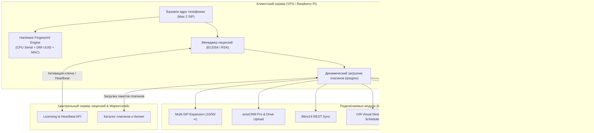
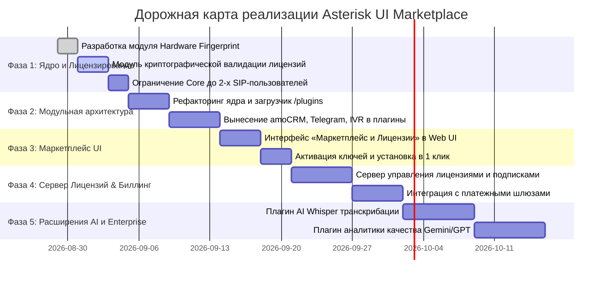

# 🗺 Дорожная карта и видение проекта: Asterisk PBX Web GUI & Marketplace

## 📌 1. Видение проекта (Project Vision)

**Asterisk UI VPS / Marketplace Edition** — модульная экосистема для корпоративной IP-телефонии, превращающая Asterisk 20+ в масштабируемую облачную платформу с монетизацией через **Маркетплейс плагинов** и надежную систему **аппаратного лицензирования**.

### Ключевая концепция:
* **Базовая версия («Из коробки» / Free Core):**
  * Бесплатный базовый функционал приема и совершения звонков через SIP-транки.
  * Создание **максимум 2-х внутренних пользователей (SIP-абонентов)**.
  * Базовая статистика CDR и встроенная вкладка **«Лицензии и Маркетплейс»**.
* **Маркетплейс плагинов (App Store):**
  * Любая расширенная функциональность (дополнительные SIP-номера, IVR-конструктор, amoCRM, Битрикс24, Telegram, FTP, AI-транскрибация) поставляется в виде независимых плагинов.
  * Плагины лицензируются по аппаратной привязке (Hardware Fingerprint) и активируются онлайн или криптографическим ключом.

---

## 🏛 2. Архитектура системы

---

## 🔐 3. Система аппаратного лицензирования (Hardware Fingerprint)

### 3.1. Алгоритм генерации отпечатка (`server_fingerprint`):
Отпечаток формируется на основе физических/виртуальных характеристик среды:
1. **Raspberry Pi:** Аппаратный серийный номер кристалла процессора из OTP ROM (`/proc/cpuinfo -> Serial`).
2. **VPS / Bare-Metal серверы:** DMI Product UUID материнской платы (`/sys/class/dmi/id/product_uuid` или `dmidecode -s system-uuid`).
3. **Сетевой интерфейс:** Неизменяемый аппаратный MAC-адрес первичного интерфейса (`eth0`/`ens3`).
4. **Результат:** Форматированный ключ `AST-XXXX-XXXX-XXXX`, гарантирующий привязку к физическому железу.

### 3.2. Защита от клонирования:
* При перестановке SD-карты/флешки в другую Raspberry Pi или клонировании снимка VPS отпечаток автоматически меняется.
* Система переходит в безопасный базовый режим (Core Free, 2 пользователя) с уведомлением в UI о необходимости переноса лицензии.

---

## 🛒 4. Каталог плагинов Маркетплейса

### 👥 4.1. Масштабирование и Емкость
* **`ext-users-10` / `ext-users-50` / `ext-users-unlimited`**: Расширение лимита внутренних SIP-аккаунтов сверх базовых 2-х пользователей.
* **`ext-multi-trunk`**: Подключение нескольких SIP-провайдеров с маршрутизацией по наименьшей стоимости (LCR) и резервированием каналов (Failover).
* **`ext-multi-tenant`**: Разделение одной АТС на несколько изолированных компаний/филиалов.

### 💼 4.2. CRM и Бизнес-интеграции
* **`crm-amocrm-pro`**: Сквозная синхронизация с amoCRM (API v4), автосоздание контактов и сделок, прямая выгрузка аудиозаписей в хранилище amoCRM Drive с нативным веб-плеером в таймлайне.
* **`crm-bitrix24`**: Интеграция с Битрикс24 (REST API, всплывающие карточки звонков, привязка лидов и записей).
* **`crm-yclients`**: Интеграция для клиник и салонов красоты (быстрый поиск клиента и визитов).
* **`crm-webhooks-engine`**: Конструктор Webhook-оповещений на сторонние URL при любых событиях звонков.

### 🎛 4.3. Голосовые сценарии и IVR
* **`ivr-visual-builder`**: Интерактивный визуальный конструктор голосового меню с загрузкой WAV-приветствий и ветвлением 0-9.
* **`ivr-work-hours`**: Умное расписание работы с маршрутизацией звонков в нерабочее время и праздничные дни.
* **`cc-queues-pro`**: Очереди колл-центра с удержанием, музыкой на удержании (MoH) и распределением вызовов.
* **`cc-spy-whisper`**: Скрытое прослушивание разговоров, суфлирование оператору и перехват вызовов.

### 📢 4.4. Уведомления и Мессенджеры
* **`notify-telegram-pro`**: Мульти-рассылка карточек звонков в личные чаты и группы, поддержка проксирования для стабильной работы при блокировках.
* **`notify-whatsapp-bot`**: Автоматическая отправка сообщений клиентам в WhatsApp после разговора.
* **`notify-sms-gateway`**: Отправка SMS через USB-модемы или SMS-шлюзы при пропущенных звонках.

### 🗄 4.5. Хранилища и Управление записями
* **`storage-ftp-sync`**: Выгрузка аудиозаписей на внешний FTP/HTTP сервер с генерацией публичных ссылок.
* **`storage-s3-cloud`**: Архивирование в облачные хранилища S3 (AWS, Yandex Object Storage, MinIO).
* **`storage-gdrive-yandex`**: Синхронизация с Google Диском и Яндекс.Диском.
* **`storage-auto-cleaner`**: Автоматическая ротация и очистка дискового пространства по квотам.

### 🤖 4.6. Искусственный интеллект (AI & Speech Analytics)
* **`ai-whisper-transcribe`**: Автоматическое распознавание речи и перевод звонков в текст (Whisper AI).
* **`ai-sentiment-analytics`**: Анализ тональности, оценка соблюдения скриптов оператором и генерация краткой выжимки (Summary) в CRM через Gemini / GPT.
* **`ai-voice-bot`**: Умный голосовой AI-ассистент первого уровня поддержки.

---

## 📅 5. Этапы реализации (Implementation Roadmap)

### 🔹 Фаза 1: Базовое ядро и Аппаратная защита (Q3 2026)
1. Реализация библиотеки `fingerprint.py` (Raspberry Pi CPU Serial + DMI UUID + MAC).
2. Реализация менеджера лицензий `license_mgr.py` с асимметричной криптографией.
3. Внедрение лимита Core-версии: максимум 2 SIP-абонента из коробки.

### 🔹 Фаза 2: Архитектура подключаемых плагинов (Q3 2026)
1. Создание каталога `/opt/asterisk-gui/plugins/`.
2. Разработка стандарта манифеста плагина (`plugin.json`, Flask Blueprint hooks, Asterisk Dialplan hooks).
3. Вынесение amoCRM, Telegram, IVR и FTP в отдельные изолированные плагины.

### 🔹 Фаза 3: Вкладка Маркетплейса в Web GUI (Q3-Q4 2026)
1. Разработка страницы **«Маркетплейс»** в панели управления.
2. Карточки плагинов с описанием, ценой, статусом и кнопками «Активировать / Купить».
3. Модальное окно ввода лицензионного ключа и онлайн-активации.

### 🔹 Фаза 4: Центральный лицензионный сервер (Q4 2026)
1. Сервис генерации ключей и валидации Heartbeat.
2. Личный кабинет партнера/покупателя с возможностью перепривязки лицензий при замене оборудования.
3. Биллинг подписок и разовых покупок.

### 🔹 Фаза 5: Продвинутые AI-модули (Q4 2026 - Q1 2027)
1. Плагин локальной/облачной транскрибации речи Whisper.
2. AI-анализ звонков (Gemini Pro) для оценки качества работы операторов.
3. Умный голосовой бот для автоматизации входящей линии.
